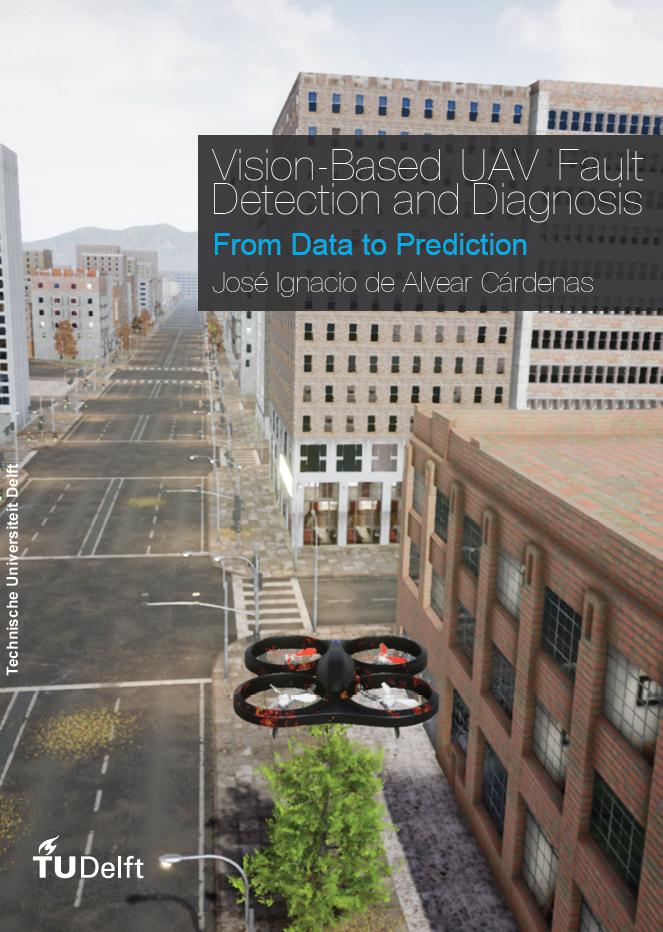

# From Data to Prediction: Vision-Based UAV Fault Detection and Diagnosis

This repository is a centralised hub for all the repositories that contain the source code of the
following literature:

1. Master thesis: "From Data to Prediction: Vision-Based UAV Fault Detection and Diagnosis".
2. Paper 1: "Blade Element Theory Model for UAV Blade Damage Simulation".
3. Paper 2: "Unreal Success: Vision-Based UAV Fault Detection and Diagnosis Frame".

The main goal of this work was the development of a knowledge-based model capable of performing 
UAV actuator fault detection and diagnosis. For that purpose, a three stage project was carried out. 
First, a more accurate blade damage model was developed than what is available in literature by 
considering the aerodynamic forces and moments. Second, a simulator was built that allows the injection 
of failures during the flight for the collection of data which can be used for the third and last step, 
which is the development of the fault detection and diagnosis framework. 

The content of each of the repositories is mentioned below:

1. *Blade_damage*: In this repository, a white-box blade damage simulation model based on Blade Element 
Theory (BET) that complements the identified healthy UAV model is implemented. To this end, the developed 
approach provides the difference in forces and moments with respect to the nominal system. 
In contrast with existing methods, the effects from both shifts in the centres of gravity and pressure 
are considered. The approach allows the injection of any level of failure without the need of added costly 
and dangerous system identification experiments. To the author’s knowledge, this is the first time BET is
used for UAV blade damage simulation and the first time mass and aerodynamic effects are modelled together 
in order to shift research towards more realistic white-box blade damage models. Furthermore, this code also 
presents a method for identifying the (mostly unknown) UAV blade lift and drag curves with respect to the 
angle of attack using BET, an approach never tried before in literature.

2. *Blade_damage_validation*: This repository provides the tools for the validation of the Blade Element Theory model.
To validate the proposed BET model, it has been applied to the Parrot Bebop® 2 UAV. Its
predictions were compared to the wrench signals of a damaged propeller at multiple degrees of failure. 
The validation data was gathered during a dedicated wind tunnel experimental campaign at the Open Jet Facility at 
Delft University of Technology which allowed the controlled variation of environmental variables such as the wind speed 
(between 0 and 12 m/s) and the propeller incidence angle (between 0 and 𝜋/2 rad).

3. *DataGatheringUE4*: This repository provides the Python tools of UUFOSim (Unreal UAV Failure injectiOn Simulator), 
a data gathering pipeline
built on AirSim for the collection of synthetic flight data with actuator failures in a urban environment within Unreal Engine 4.
The potential of UUFOSim has been demonstrated for the Parrot Bebop® 2 UAV. Its aerodynamic model is available
from [literature](https://ieeexplore.ieee.org/document/8764021) and it has been complemented with the blade damage model.

4. *Airlib_FDD*: This repository provides the modified C++ AirSim plugin for the generation of drone sensor data under 
actuator faults using the AirSim simulator within Unreal Engine 4.

5. *FDD*: This repository provides the implementation of the Fault Detection and Diagnosis Model.
It is an LSTM-based online FDD framework that fuses camera and 
IMU data is proposed.
To this end, the camera information is pre-processed by the [Raft](https://pytorch.org/vision/main/models/raft.html) 
optical flow model in order to extract the magnitude
and direction of the vehicle’s ego-motion. The IMU data is passed through a Short-Time Fourier Transform for
feature extraction. To the authors’ knowledge, it is the first time that both sensor sources are combined for UAV FDD.
The potential of the FDD has been demonstrated for the Parrot Bebop® 2 UAV in simulation. The FDD framework
was run at 10 Hz and it had to distinguish between 17 states: 16 failure states, namely four levels of blade damage failure
for each of the four propellers, and a healthy state.

## Note
The present repository is meant as a centralised hub where the user can find all the working repositories 
of the project. It is recommended that the user clones each of the aforementioned repositories separately, 
instead of cloning this repository with the others as submodules.

## Contact
Hope you enjoy the code!! For any questions, comments or suggestions, 
please reach out to me at [jialvear@hotmail.com](jialvear@hotmail.com).

    @inproceedings{dealvear2024BET,
      title={Blade Element Theory Model for UAV Blade Damage Simulation},
      author={de Alvear Cárdenas, J.I. and de Visser, C.},
      booktitle={AIAA Scitech 2024 Forum},
      year={2024}
    }

    @inproceedings{dealvear2024UE4,
      title={Unreal Success: Vision-Based UAV Fault Detection and Diagnosis Framework},
      author={de Alvear Cárdenas, J.I. and de Visser, C.},
      booktitle={AIAA Scitech 2024 Forum},
      year={2024}
    }